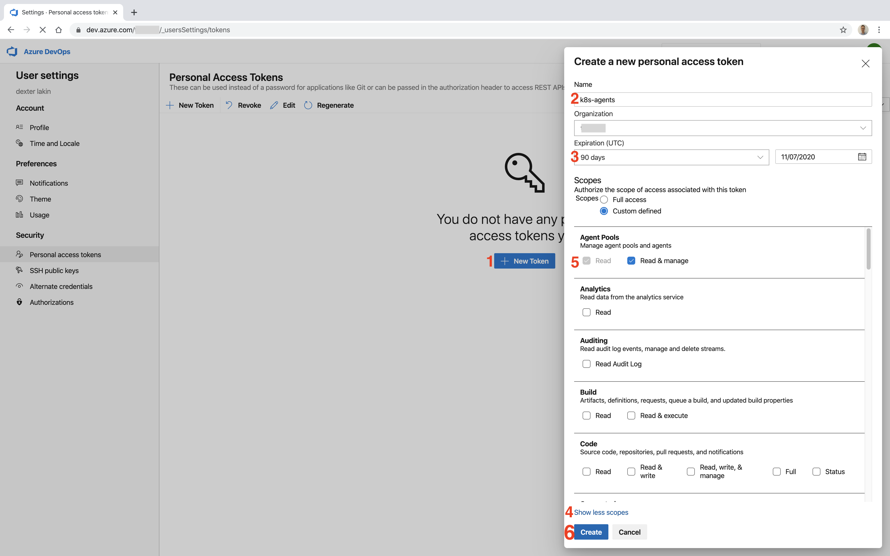
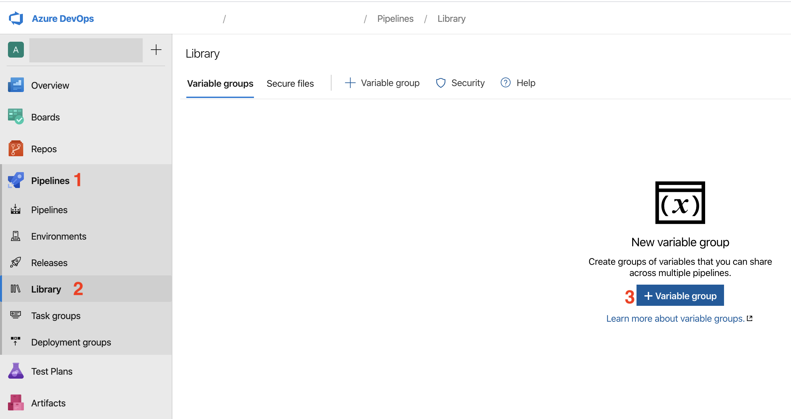
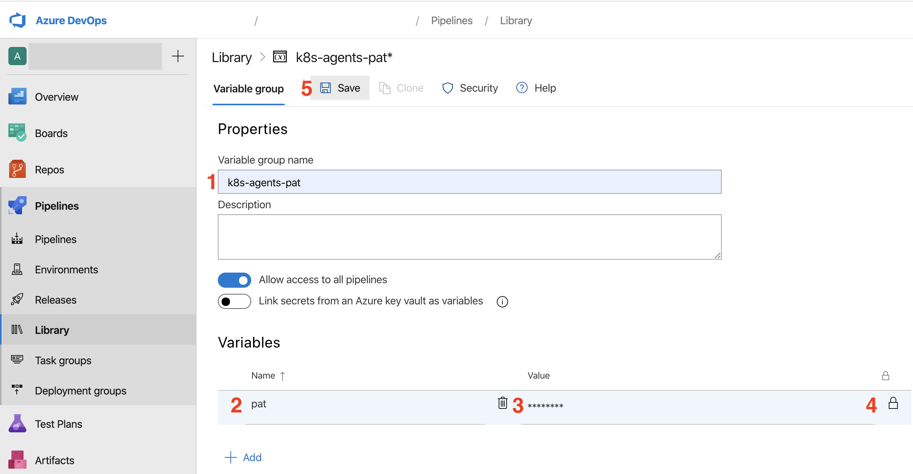
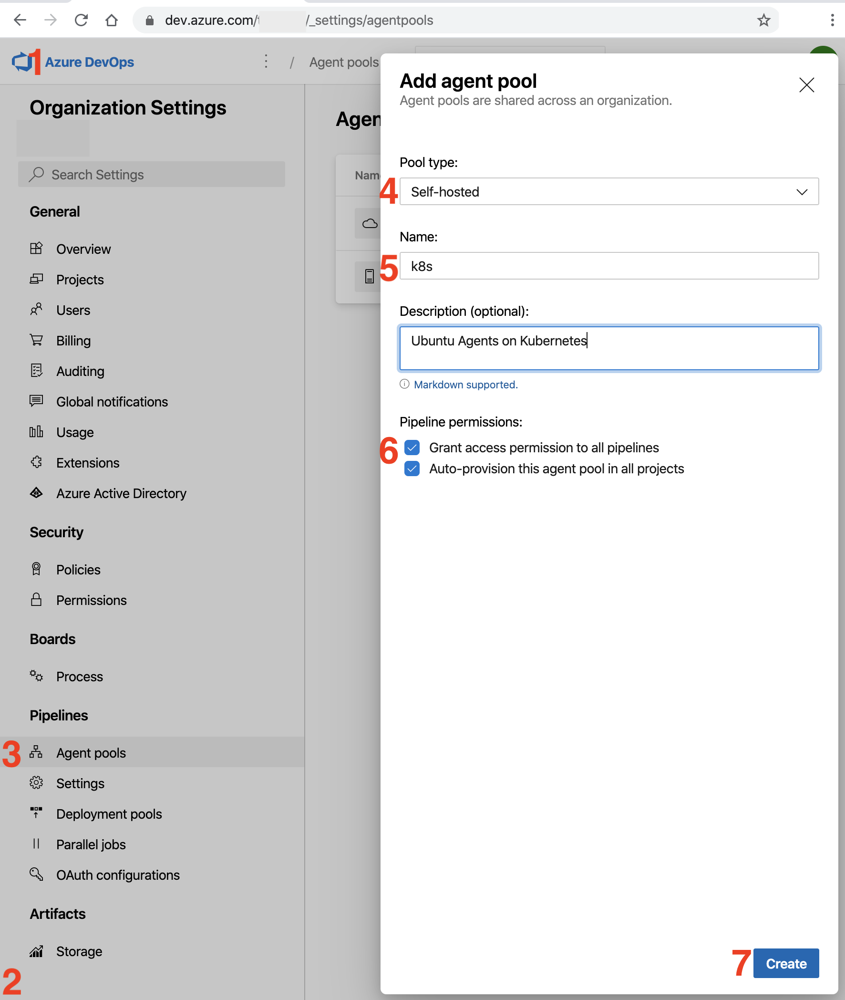
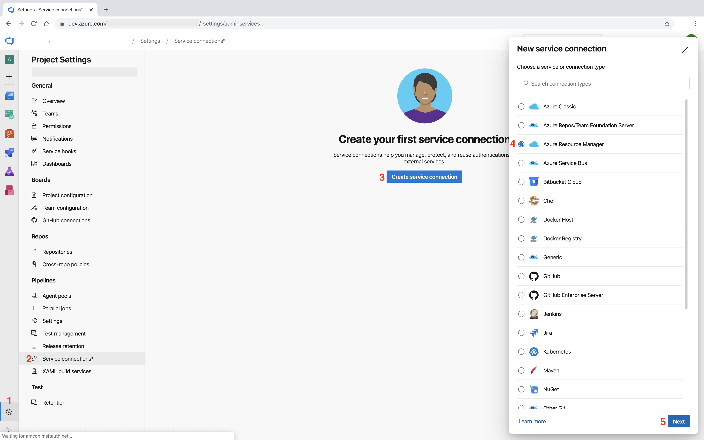
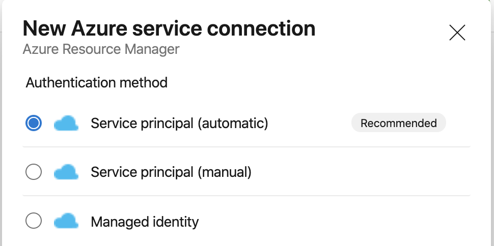
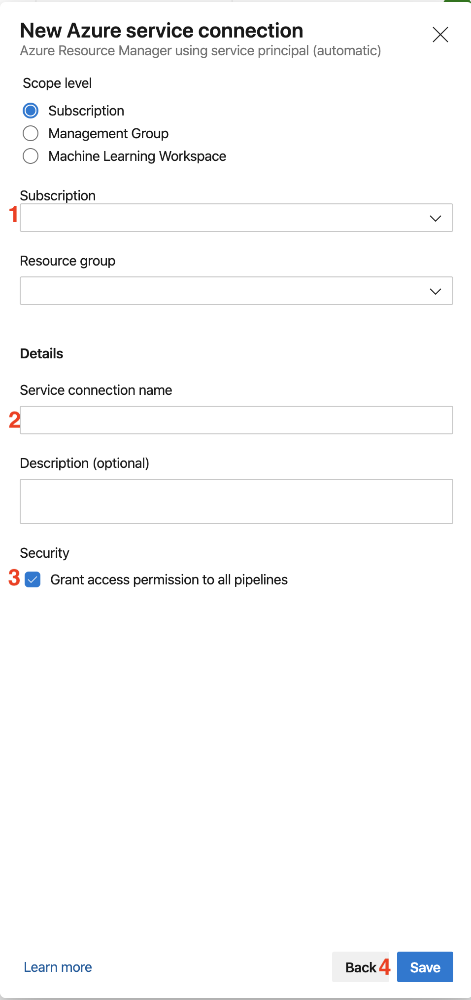
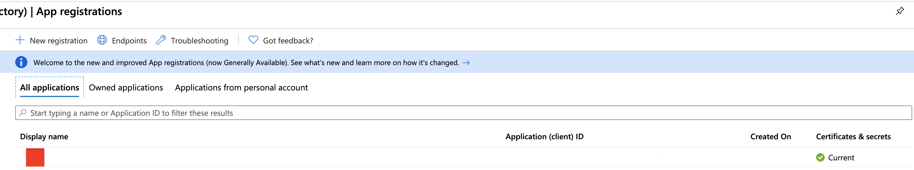
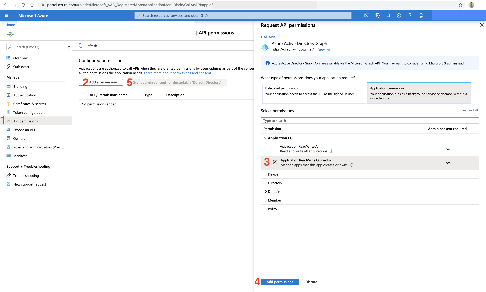

# Prerequisites

Before getting started, you'll need these:
<!-- TOC depthfrom:2 depthto:2 -->

- [This repo](#this-repo)
- [An Azure Free Trial Subscription](#an-azure-free-trial-subscription)
- [An Azure Devops organisation](#an-azure-devops-organisation)
- [A Personal Access Token](#a-personal-access-token)
- [An Agent Pool](#an-agent-pool)
- [A Service Connection](#a-service-connection)
- [Some Permissions](#some-permissions)

<!-- /TOC -->

## This repo

Clone or fork a copy of this repo to your SCM of choice -- Github, Bitbucket, Azure Git Repos etc.

## An Azure Free Trial Subscription

To get a free 12-month trial of Azure, follow the instructions [here](https://azure.microsoft.com/en-gb/free/).

## An Azure Devops organisation

If you don't already have one, create a free Azure DevOps organisation, as per [these instructions](https://azure.microsoft.com/en-gb/services/devops). You'll also need to [create a Project](https://docs.microsoft.com/en-us/azure/devops/organizations/projects/create-project?view=azure-devops&tabs=preview-page).

## A Personal Access Token
Once you've create your Azure DevOps organisation, you'll need a [Personal Access Token](https://docs.microsoft.com/en-us/azure/devops/organizations/accounts/use-personal-access-tokens-to-authenticate?view=azure-devops&tabs=preview-page)(PAT) with the authorized scopes Agent Pools(read, manage). To do this you'll need to:

1. Navigate here:

2. Create the PAT with the required scopes. Set the name and expiration as you see fit. Make sure to copy the token in the next screen.

3. Next, create a Variable Group for the token

4. Name the Variable Group and Variable exactly as shown. Paste the value for the PAT in 'Value', and click the lock icon so that the Variable is stored as a [Secret Variable](https://docs.microsoft.com/en-us/azure/devops/pipelines/process/variables?view=azure-devops&tabs=yaml%2Cbatch#secret-variables).

:exclamation:**Note:** If you want to rename the Variable Group, you'll have to update some values in [this pipeline](pipelines/helm_agents.yaml) first.

## An Agent Pool
Create the 'k8s' [agent pool](https://docs.microsoft.com/en-us/azure/devops/pipelines/agents/pools-queues?view=azure-devops&tabs=yaml%2Cbrowser).

## A Service Connection

To enable Azure DevOps to deploy into our Azure Subscription, we need to connect those services using a [Service Connection](https://docs.microsoft.com/en-us/azure/devops/pipelines/library/connect-to-azure?view=azure-devops). To do this:

1. Navigate to the 'Project Settings' page and click on 'New Service Connection'. Select type 'Azure Resource Manager'.

2. On the next screen, select the ['Service Principal'](https://docs.microsoft.com/en-us/azure/active-directory/develop/app-objects-and-service-principals) authentication method.

3. Enter the connection details as required (leave Resource Group blank) and save.

:exclamation:**Note:** By default all Pipelines default the Service Connection name to 'azure'. This can be overriden when a Pipeline is run. If you name the Service Connection something other than 'azure', be sure to do this in the next section!

## Some Permissions

Next we need to give the newly-created Service Principal permission to deploy Resources. To do this:

1. In the Azure Portal, navigate to the [Azure Active Directory (AAD) Blade](https://portal.azure.com/#blade/Microsoft_AAD_IAM/ActiveDirectoryMenuBlade/Overview)

2. Select 'App Registrations' and find the newly-created App Registration. The name should follow the pattern:
\<Azure Devops Organisation Name\>\<Azure DevOps Project Name\>\<Azure Subscription ID\>

Take a note of the name and ID for later.

3. Add the API permission 'Azure Active Directory Graph/Application.ReadWrite.OwnedBy', and click the 'Grant Admin consent' button on the next screen to approve the permissions assignment. You should see the message 'Successfully granted admin consent for the requested permissions'.

4. Next, go to your Subscription, and give the App Registration the [Owner IAM Role for your Subscription](https://docs.microsoft.com/en-us/azure/role-based-access-control/role-assignments-portal).

:exclamation:**Note:** The 'Owner' Role is required to provision another Service Principal, required by [Azure Kubernetes Service](https://azure.microsoft.com/en-gb/services/kubernetes-service/), and bind permissions to it so that it can Pull images from the [Azure Container Registry](https://azure.microsoft.com/en-gb/services/container-registry/). Obviously this doesn't follow [least priviledge](https://en.wikipedia.org/wiki/Principle_of_least_privilege).

Before taking this solution anywhere near an Enterprise Subscription, it would be recommended to create a [Custom Role](https://docs.microsoft.com/en-us/azure/role-based-access-control/custom-roles), and providing the Azure DevOps App Registration [Just in Time Access](https://docs.microsoft.com/en-us/azure/active-directory/privileged-identity-management/pim-configure) for the initial deployment of the Kubernetes Service.

### **
[Onwards, captain!](./02_deploy.md)
**
