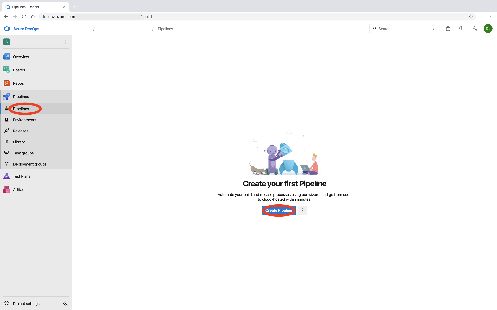
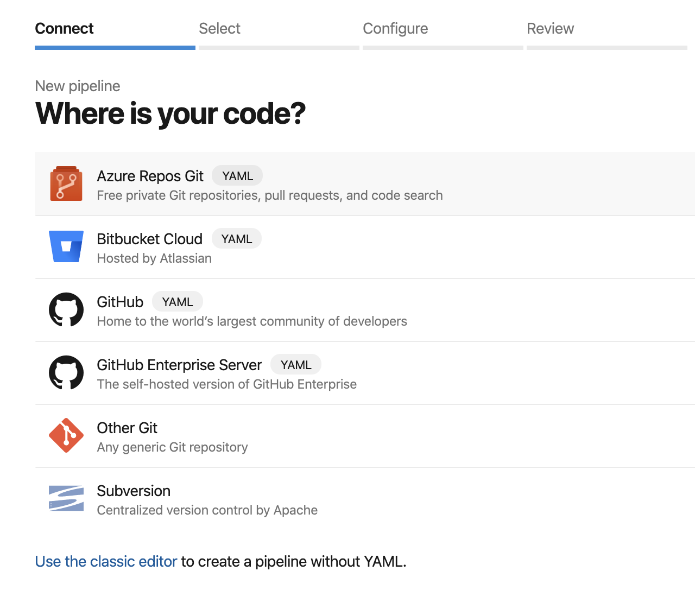
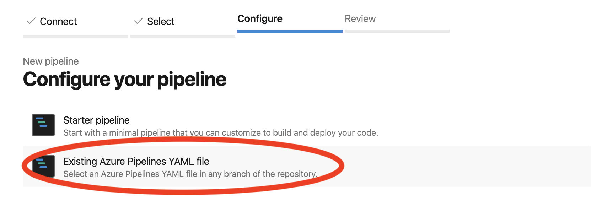

# Running the pipelines

Next we'll run the Azure Pipelines that will deploy:
<!-- TOC depthfrom:2 depthto:2 -->

- [A Backend for Terraform](#a-backend-for-terraform)
- [AKS and ACR](#aks-and-acr)
- [Azure DevOps Agents (running on AKS)](#azure-devops-agents-running-on-aks)
- [A Test Pipeline](#a-test-pipeline)

<!-- /TOC -->

## A Backend for Terraform

To deploy Kubernetes with Terraform, we first need to deploy a [Blob Storage Account, so that state files can be persisted remotely](https://docs.microsoft.com/en-us/azure/terraform/terraform-backend).

1. From Azure DevOps Pipelines, create a New Pipeline

2. On the next screen, select the Source Control Manager you're using.

3. On the next screen, select 'Existing Azure Pipelines YAML file'. For the path enter ['pipelines/tf_backend.yaml'](pipelines/tf_backend.yaml)

4. On the next screen, select 'Existing Azure Pipelines YAML file'

5. For the path enter ['pipelines/tf_backend.yaml'](../pipelines/tf_backend.yaml)

## AKS and ACR

Next we're going to deploy Azure Kubernetes Service and Azure Container Registry. This is a fully automated deployment so follow the same steps as above, but for the path enter ['pipelines/k8s.yaml'](../pipelines/k8s.yaml)

## Azure DevOps Agents (running on AKS)

Finally, we'ill deploy the Azure DevOps agents using [Docker](https://www.docker.com/) and [Helm 3](https://helm.sh/blog/helm-3-released/). As above, this is a fully automated deployment so follow the same steps as above, but for the path enter ['pipelines/helm_agents.yaml'](../pipelines/helm_agents.yaml)

## A Test Pipeline

To test, we'll deploy an instance of Wordpress to our cluster, using the Agents we just deployed to run the pipelines. This is requires running another pipeline, so follow the same steps as above, but for the path enter ['pipelines/test.yaml'](../pipelines/test.yaml)

Once this Pipeline has completed the run you can navigate to the Public IP of the new Wordpress site and log into the admin screen using the commands listed in the Pipeline output, to verify that Wordpress was correctly deployed.

### **
[Wrapping up](./03_summary.md)
**